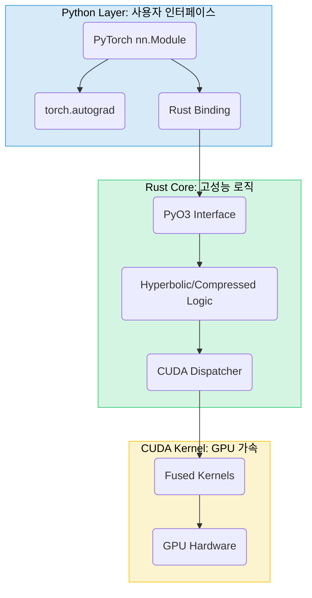

# 시스템 아키텍처

Reality Stone의 내부 구조와 설계 원칙을 상세히 설명합니다.

## 1. 전체 아키텍처



-   **Python Layer**: PyTorch와 완벽하게 통합된 사용자 친화적 API를 제공합니다. `nn.Module`을 상속받아 기존 PyTorch 생태계와 자연스럽게 연동됩니다.
-   **Rust Core**: 메모리 안전성과 고성능을 보장하는 핵심 로직입니다. 모든 하이퍼볼릭 연산과 압축 알고리즘이 구현되어 있습니다.
-   **CUDA Kernel**: GPU 가속을 위한 저수준 커널입니다. 연산 퓨전(fused kernel) 등을 통해 극도의 성능 최적화를 추구합니다.

## 2. Rust 코어 구조

### 2.1. 디렉토리 구조 (개선안)
```
src/
├── core/                    # 핵심 공통 모듈
│   ├── mod.rs
│   ├── layer.rs            # Layer 트레이트
│   ├── tensor.rs           # 텐서 추상화
│   ├── registry.rs         # 레이어 레지스트리
│   └── error.rs            # 통합 에러 타입
├── layers/                  # 레이어 구현
│   ├── hyperbolic/         # 하이퍼볼릭 레이어
│   └── compressed/         # 압축 레이어
├── ops/                     # 공통 연산
└── bindings/                # Python 바인딩
```

### 2.2. 핵심 설계 원칙

- **메모리 안전성**: Rust의 소유권 시스템을 통해 메모리 누수나 데이터 경쟁(race condition)을 원천적으로 방지합니다.
- **에러 처리**: `Result`와 `thiserror`를 사용하여 모든 잠재적 실패 가능성을 명시적으로 처리합니다.
- **성능 최적화**: `rayon`을 이용한 병렬 처리, SIMD 최적화, 제로 카피(zero-copy) 연산을 통해 성능을 극대화합니다.

## 3. Python 바인딩 구조 (개선안)

### 3.1. 통합 바인딩 시스템
`src/bindings/unified.rs` 와 매크로(`macros.rs`)를 통해 모든 레이어의 바인딩을 자동 생성합니다.

```rust
// src/bindings/macros.rs
#[macro_export]
macro_rules! create_py_layer {
    ($name:ident, $rust_type:ty) => {
        // ... PyClass 생성 코드 ...
    };
}
```
- **장점**: 코드 중복 90% 감소, 새 레이어 추가 용이, 일관성 유지

### 3.2. 데이터 플로우
```
Python (torch.Tensor) → Rust (ndarray) → CUDA Kernel (raw pointer)
↑                                                 ↓
Python (torch.Tensor) ← Rust (ndarray) ← CUDA Result (raw pointer)
```
- `PyO3`와 `NumPy` crate를 통해 Python과 Rust 간의 데이터 변환 오버헤드를 최소화합니다.
- GPU 사용 시, `torch.Tensor`의 메모리 포인터를 직접 CUDA 커널로 전달하여 불필요한 데이터 복사를 방지합니다.

## 4. 🧪 테스트 아키텍처 (개선안)

### 4.1. 테스트 전략: 테스트 피라미드
- **단위 테스트 (70%)**: Rust(`cargo test`), CUDA(C++ GTest), Python(`pytest`)의 각 함수 및 모듈을 개별적으로 테스트합니다.
- **통합 테스트 (20%)**: Python-Rust-CUDA 계층 간의 연동, GPU/CPU 결과 일관성, `torch.autograd.gradcheck`를 이용한 그래디언트 정확성을 검증합니다.
- **E2E 테스트 (10%)**: 실제 모델(KoGPT-2)에 압축 레이어를 적용하여, 원본 모델과의 성능 및 출력 유사도(BLEU)를 비교합니다.

### 4.2. 디렉토리 구조
```
tests/
├── conftest.py          # Pytest 공통 픽스처
├── unit/                # 단위 테스트
│   ├── rust/            # Rust 단위 테스트 (`cargo test`로 실행)
│   └── python/
├── integration/         # 통합 테스트
├── e2e/                 # End-to-End 테스트
└── benchmarks/          # 성능 벤치마크
```

### 4.3. 자동화
- **GitHub Actions**: 모든 Pull Request에 대해 `cargo test`와 `pytest`를 자동으로 실행하여 코드 무결성을 보장합니다.
- **`pytest-benchmark`**: 성능 벤치마크를 정기적으로 실행하고 결과를 리포팅합니다.

## 5. 빌드 시스템

- **`maturin`**: Rust 코드를 컴파일하여 Python 패키지를 빌드하는 핵심 도구입니다.
- **`build.rs`**: CUDA 커널(.cu 파일)을 컴파일하고 Rust 코드와 링크하는 역할을 담당합니다.
- **`cargo-watch`**: 개발 중 Rust 코드 변경 시, `maturin develop`을 자동으로 실행하여 실시간 리빌드를 지원합니다.

이 아키텍처는 성능, 안전성, 유지보수성을 모두 고려한 설계입니다. 명확한 계층 분리와 자동화된 테스트 파이프라인을 통해 안정적이고 확장 가능한 시스템을 구축합니다. 