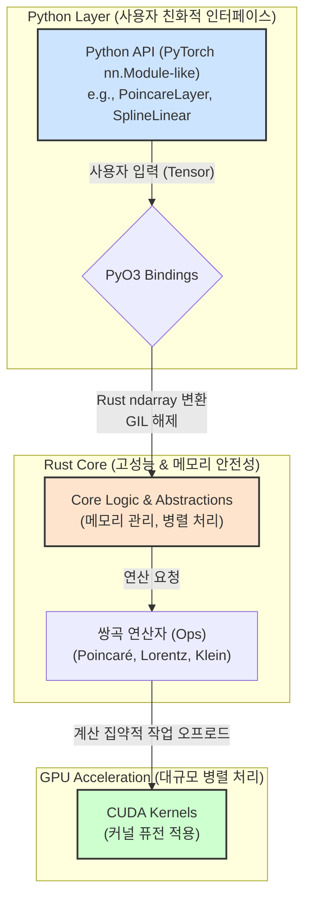

## 5. 시스템 아키텍처: 성능, 안정성, 사용성의 삼위일체

`Reality Stone`은 높은 사용성을 제공하는 Python 인터페이스, 메모리 안전성과 최고 수준의 CPU 성능을 보장하는 Rust 코어, 그리고 대규모 병렬 연산을 위한 CUDA 가속 계층이라는 세심하게 설계된 다층 아키텍처를 채택하고 있다.

1.  **Python API Layer (사용성)**: 사용자와 직접 상호작용하는 최상위 계층이다. PyTorch의 `nn.Module`과 완벽하게 호환되는 인터페이스(`PoincareLayer`, `SplineLinear` 등)를 제공하여, 기존 딥러닝 개발자들이 최소한의 학습 비용으로 쌍곡 신경망을 구축하고 실험할 수 있도록 설계되었다.
    -   **작동 방식**: 사용자가 `layer.forward(tensor)`를 호출하면, 내부적으로 **PyO3 프레임워크**가 PyTorch 텐서를 Rust의 `ndarray` 타입으로 거의 비용 없이 변환하고, GIL(Global Interpreter Lock)을 해제한 뒤 Rust로 구현된 고성능 함수를 직접 호출한다.

2.  **Rust Core Layer (안전성과 속도)**: 라이브러리의 심장부로서, 모든 핵심 수학 연산, 자료구조, 그리고 알고리즘이 Rust로 구현되어 있다.
    -   **메모리 안전성**: Rust의 소유권(Ownership) 시스템과 차용(Borrowing) 규칙은 컴파일 시점에 메모리 누수나 데이터 경쟁(data race)과 같은 동시성 버그를 원천적으로 방지한다. 이를 통해 멀티스레딩 환경에서도 `Arc<Mutex<T>>`와 같은 동기화 프리미티브를 사용하여 안전하고 예측 가능한 성능을 제공한다.
    -   **고성용 CPU 연산**: `src/ops` 디렉토리에는 각 쌍곡 모델에 대한 핵심 연산(뫼비우스 덧셈, 지수/로그 사상 등)이 구현되어 있다. Rust 코드는 SIMD(Single Instruction, Multiple Data) 연산을 자동으로 활용하고, LLVM 백엔드를 통해 고도로 최적화된 기계어로 컴파일되어 Python 네이티브 코드보다 월등히 빠른 속도를 보인다.

3.  **GPU Acceleration Layer (대규모 병렬 처리)**: 모델 학습과 같이 계산 집약적인 작업을 가속하기 위해, C++로 작성된 CUDA 커널이 `src/ops/cuda`에 위치한다.
    -   **효율적 오프로딩**: Rust 코드는 C++ Foreign Function Interface(FFI)를 통해 필요한 연산을 CUDA 커널로 오프로드(offload)하여 GPU의 수천 개 코어를 활용한 병렬 처리 능력을 극대화한다.
    -   **커널 퓨전 (Kernel Fusion)**: 쌍곡 공간의 뫼비우스 덧셈처럼 복잡하지만 여러 단계로 구성된 원소별(element-wise) 연산을 **단일 CUDA 커널로 통합(fusion)**하는 최적화를 적용했다. 이는 여러 번의 개별 연산 호출로 인해 발생하는 GPU 메모리와 코어 간의 데이터 전송 병목을 최소화하여, 전체 연산 시간을 획기적으로 단축시킨다.

이러한 3-tier 아키텍처를 통해, `Reality Stone`은 최종 사용자에게는 쉬운 사용성을, 시스템 레벨에서는 최고 수준의 성능과 안정성을 동시에 제공하는 목표를 달성한다. 