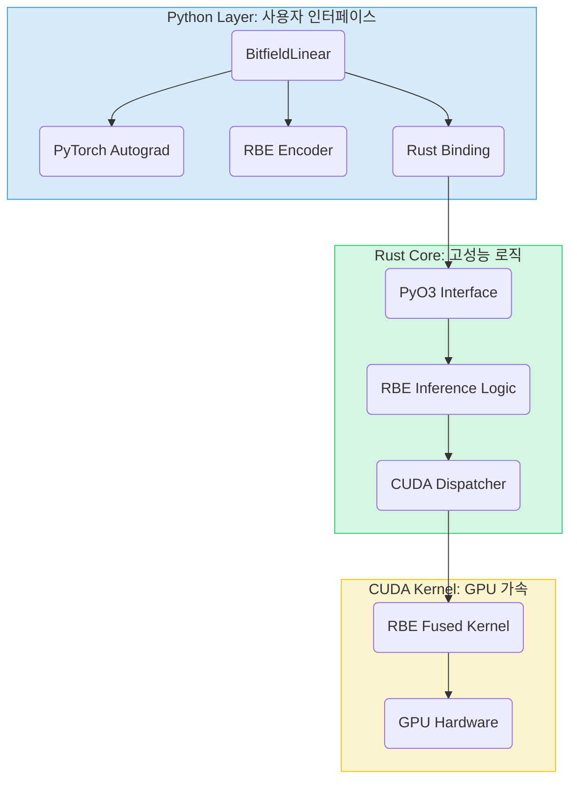

## 5. 시스템 아키텍처: RBE의 구현

`Reality Stone`은 RBE의 복잡한 연산을 사용자에게는 숨기고, PyTorch의 `nn.Module`처럼 친숙하고 편리한 인터페이스를 제공하기 위해 신중하게 설계된 다층 아키텍처를 채택했다. 본 장에서는 RBE의 인코딩과 추론이 시스템 내부에서 어떻게 처리되는지를 상세히 기술한다.

### 5.1. 전체 아키텍처 개요

`Reality Stone`은 크게 세 가지 계층으로 구성된다.



-   **Python Layer (사용자 인터페이스):** 사용자가 직접 상호작용하는 최상위 계층. `BitfieldLinear`와 같은 PyTorch 모듈을 제공한다. 가중치를 RBE 포맷으로 변환하는 **인코딩 로직**과, Rust 코어를 호출하여 실제 연산을 수행하는 **바인딩**을 담당한다.
-   **Rust Core (고성능 로직):** 라이브러리의 심장부. 메모리 안정성이 보장되는 Rust로 모든 핵심 알고리즘이 구현되어 있다. Python으로부터 요청을 받아, 압축된 데이터로부터 추론을 수행하는 **RBE 추론 로직**과, 연산을 GPU로 보낼지 CPU에서 처리할지를 결정하는 **디스패처**를 포함한다.
-   **CUDA Kernel (GPU 가속):** 대규모 병렬 처리가 필수적인 RBE 추론을 위해 특별히 제작된 **통합 커널(Fused Kernel)** 이다. GPU 하드웨어의 특성(공유 메모리, 텐서 코어 등)을 최대한 활용하여 성능을 극대화한다.

### 5.2. 오프라인 인코딩 파이프라인

사용자가 `BitfieldLinear.from_linear(original_layer)`를 호출할 때, Python 계층에서 다음과 같은 오프라인 인코딩 파이프라인이 실행된다.

```mermaid
graph LR
    W[원본 가중치 행렬 W] --> P1{1. 최적 기저 탐색};
    P1 -->|기저 인덱스 IDX| P2{2. 기저 함수 선택};
    P2 -->|함수 코드 (CAT, SUB, D)| P3{3. 파라미터 양자화};
    P3 -->|크기 AMP| P4[4. 비트 필드 패킹];
    P4 --> W_codes[기저 청사진 W_codes];
    
    subgraph 잔차 계산
        direction LR
        W --> M1(청사진으로 W_approx 재구성);
        W_approx[근사 행렬 W_approx] --> M2;
        W --> M2{원본 - 근사};
        M2 --> M3[저정밀도 양자화];
        M3 --> W_res[잔차 행렬 W_res];
    end

    style W fill:#FADBD8,stroke:#C0392B
    style W_codes fill:#D5F5E3,stroke:#28B463
    style W_res fill:#D6EAF8,stroke:#3498DB
```

1.  **최적 기저 탐색:** 원본 가중치 행렬 $W$의 각 행을 순회하며, 미리 정의된 기저 벡터 테이블과 비교하여 가장 유사한 기저의 인덱스(`IDX`)를 찾는다.
2.  **기저 함수 선택:** 선택된 기저 방향으로 투영된 가중치의 특성을 분석하여, 64개의 리만 함수 라이브러리 중 가장 표현 오차가 적은 함수(`CAT`, `SUB`, `D`)를 선택한다.
3.  **파라미터 양자화:** 선택된 함수에 필요한 파라미터(예: 크기)를 8비트 정수(`AMP`)로 양자화한다.
4.  **비트 필드 패킹:** 위에서 구한 `IDX, CAT, SUB, D, AMP`를 22비트 정수 하나로 압축하여 **기저 청사진($W_{\text{codes}}$)** 을 생성한다.
5.  **잔차 계산 및 양자화:** 청사진으로 재구성한 근사 행렬 $W_{\text{approx}}$를 원본 $W$에서 빼서 **잔차 행렬**을 계산하고, 이를 다시 8비트 정수 등으로 양자화하여($W_{\text{res}}$) 저장한다.

이 과정을 거쳐 생성된 $W_{\text{codes}}$와 $W_{\text{res}}$가 `BitfieldLinear` 레이어의 최종 학습 가능 파라미터가 된다.

### 5.3. 온라인 추론 파이프라인

학습/추론 시, `compressed_layer(input_tensor)`가 호출되면 다음과 같은 온라인 추론 파이프라인이 실행된다.

```mermaid
graph TD
    subgraph Python
        A[입력 텐서] --> B{BitfieldLinear.forward()};
        B --> C[Rust 바인딩 호출];
    end

    subgraph Rust
        C --> D{rbe_inference_dispatcher};
        D -- GPU 지원 시 --> E[CUDA 커널 호출];
        D -- GPU 미지원 시 --> F[CPU 병렬 연산];
    end

    subgraph CUDA
        E --> G[RBE 통합 커널 실행];
        subgraph G
            direction LR
            G1[공유 메모리에 Dot Product 계산] --> G2[병렬 디코딩 & 추론] --> G3[청사진 결과 + 잔차 결과];
        end
    end
    
    G3 --> H{결과 반환};
    F --> H;
    H --> I[Python으로 결과 전달];
    I --> J[출력 텐서];
```

1.  **Python 계층:** `BitfieldLinear`의 `forward` 메소드가 호출된다. 입력 텐서와 레이어가 가진 `W_codes`, `W_res`가 PyO3 바인딩을 통해 Rust 코어로 전달된다.
2.  **Rust Core (디스패처):** Rust의 `rbe_inference_dispatcher` 함수는 현재 시스템이 CUDA를 지원하는지 확인한다.
3.  **CUDA Kernel (GPU 경로):**
    -   **데이터 전송:** 입력 텐서, $W_{\text{codes}}$, $W_{\text{res}}$, 기저 테이블이 GPU 메모리로 복사된다.
    -   **통합 커널 실행:** RBE를 위해 특별히 설계된 단일 CUDA 커널이 실행된다.
        -   **1단계 (전처리):** 입력과 기저 테이블의 내적을 계산하여 스레드들이 공유하는 '공유 메모리'에 저장한다. (메모리 대역폭 절약)
        -   **2단계 (병렬 추론):** 수천 개의 스레드가 각각 출력의 한 요소를 담당하여, `W_codes`에서 자신의 정보를 디코딩하고, 공유 메모리의 값을 활용해 청사진 결과를 계산한다. 동시에 `W_res`와의 저정밀도 연산을 수행하여 잔차 결과를 더한다.
    -   **결과 반환:** 계산된 결과가 CPU로 다시 복사되어 Python으로 반환된다.
4.  **CPU 경로:** CUDA를 사용할 수 없는 경우, Rust의 Rayon 라이브러리를 사용해 CPU 코어 전반에 걸쳐 연산을 병렬화하여 처리한다.

이러한 **통합 커널(Fused Kernel)** 설계와 **계산-메모리 중첩**은 RBE 추론 성능의 핵심으로, 여러 번의 메모리 접근을 한 번으로 줄여 GPU의 성능을 한계까지 끌어낸다. 